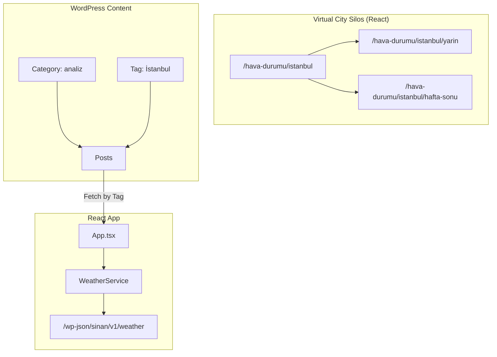
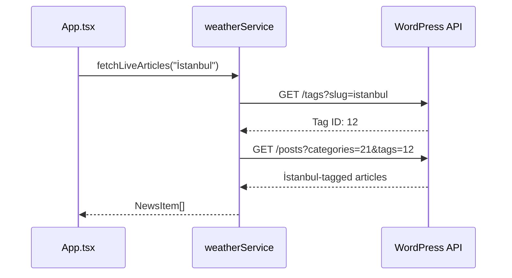

# WordPress Integration Guide

> **Last Updated:** December 23, 2025  
> **Version:** 3.0 (Silo Protocol)

---

## Architecture Overview



---

## URL Structure: Silo Protocol

### Virtual App Routes (No WP Database)

| URL Pattern | Type | Generated By |
|-------------|------|--------------|
| `/hava-durumu/{city}` | Hub | React Router |
| `/hava-durumu/{city}/yarin` | Spoke | React Router |
| `/hava-durumu/{city}/hafta-sonu` | Spoke | React Router |

> 81 cities × 3 views = **243 landing pages instantly** without database bloat.

### Content Routes (WordPress)

| URL Pattern | Type | Source |
|-------------|------|--------|
| `/analiz` | Category Archive | WP Category |
| `/konu/istanbul` | Tag Archive | WP Tag |

---

## PHP Snippets

### Snippet 1: URL Rewrite Rules

```php
/**
 * SINAN URL REWRITE RULES (Silo Protocol)
 */
add_action('init', function() {
    add_rewrite_tag('%city_slug%', '([^&]+)');
    add_rewrite_tag('%weather_view%', '([^&]+)');

    // /hava-durumu/istanbul/yarin
    add_rewrite_rule(
        '^hava-durumu/([^/]+)/(yarin|hafta-sonu)/?$',
        'index.php?pagename=hava-durumu&city_slug=$matches[1]&weather_view=$matches[2]',
        'top'
    );

    // /hava-durumu/istanbul
    add_rewrite_rule(
        '^hava-durumu/([^/]+)/?$',
        'index.php?pagename=hava-durumu&city_slug=$matches[1]',
        'top'
    );
});
```

### Snippet 2: React Bridge V3

```php
function sinan_render_react_root($atts) {
    global $wp_query;
    $url_city = get_query_var('city_slug');
    $url_view = get_query_var('weather_view');

    $city = !empty($url_city) ? $url_city : ($atts['city'] ?? 'istanbul');
    $city_display = sinan_get_turkish_city_name($city);

    $initial_state = [
        'city' => $city_display,
        'view' => ($url_view === 'yarin') ? 'tomorrow' : 
                  (($url_view === 'hafta-sonu') ? 'weekend' : 'home')
    ];

    $output = '<div id="weather-app" ';
    $output .= 'data-initial-city="' . esc_attr($initial_state['city']) . '" ';
    $output .= 'data-initial-view="' . esc_attr($initial_state['view']) . '" ';
    $output .= 'aria-live="polite" aria-busy="true">';
    
    $output .= '<noscript><article><h1>' . esc_html($city_display) . ' Hava Durumu</h1></article></noscript>';
    $output .= '<div class="react-skeleton-loader">Yükleniyor...</div>';
    $output .= '</div>';

    return $output;
}
add_shortcode('sinan_weather_app', 'sinan_render_react_root');
```

### Snippet 3: SEO Engine V2

```php
add_action('wp_head', 'sinan_render_weather_seo', 1);

function sinan_render_weather_seo() {
    if (!is_page('hava-durumu')) return;

    $city_slug = get_query_var('city_slug') ?: 'istanbul';
    $view = get_query_var('weather_view') ?: '';
    
    $city_name = sinan_get_turkish_city_name($city_slug);
    $timeframe = match($view) {
        'yarin' => 'Yarın',
        'hafta-sonu' => 'Hafta Sonu',
        default => 'Bugün'
    };

    $title = "$city_name Hava Durumu | $timeframe, 15 Günlük Tahmin | TG";
    
    echo "<title>" . esc_html($title) . "</title>\n";
    // ... rest of meta tags
}
```

### Snippet 4: Taxonomy Cleanup

```php
/**
 * SINAN TAXONOMY CLEANUP
 * /category/analiz -> /analiz
 * /tag/istanbul -> /konu/istanbul
 */
add_action('init', function() {
    global $wp_rewrite;
    $wp_rewrite->category_base = '';
    $wp_rewrite->tag_base = 'konu';
});
```

---

## Taxonomy Strategy

### Categories (3 Only)

| Category | Slug | Purpose |
|----------|------|---------|
| Meteorolojik Analiz | `analiz` | Storm warnings, weekly outlooks |
| Ekonomik Etki | `ekonomi` | Agriculture, energy, logistics |
| Genel | `genel` | Site updates (exclude from feed) |

### Tags (City Semantic Bridge)

Use WordPress Tags to represent cities:
- `İstanbul`, `Ankara`, `İzmir`...

**V2 Feature:** Fetch articles by city tag for hyper-relevant dashboards.

---

## Frontend Changes (App.tsx)

### Silo Protocol Routing

```typescript
// handleCityChange - Line 377
let path = `/hava-durumu/${slug}`;
if (view.type === 'tomorrow') path += '/yarin';
else if (view.type === 'weekend') path += '/hafta-sonu';
window.history.pushState({ city }, '', path);

// URL Parsing - Line 226
// segments[0] = 'hava-durumu'
// segments[1] = city slug
// segments[2] = view (yarin/hafta-sonu)
```

---

## Tag Bridge (Context-Aware Articles)

The Smart Tag Bridge enables hyper-relevant content feeds by filtering articles based on the currently viewed city.

### How It Works



### Implementation (weatherService.ts)

```typescript
// CONFIGURATION: Replace with your Analiz category ID
const ANALYSIS_CATEGORY_ID = 21;

export const fetchLiveArticles = async (cityName?: string) => {
  let endpoint = `/wp-json/wp/v2/posts?_embed&per_page=6&categories=${ANALYSIS_CATEGORY_ID}`;

  if (cityName) {
    // Convert "İstanbul" -> "istanbul" for tag lookup
    const tagSlug = toSlug(cityName);
    const tagRes = await fetch(`/wp-json/wp/v2/tags?slug=${tagSlug}`);
    const tags = await tagRes.json();
    
    if (tags.length > 0) {
      endpoint += `&tags=${tags[0].id}`;
    }
  }
  // ... fetch and return articles
};
```

### WordPress Setup Requirements

1. Create a Category: **Meteorolojik Analiz** (ID: 21)
2. Create Tags for cities: **İstanbul**, **Ankara**, etc.
3. When writing posts, assign both Category AND relevant city Tag

---

## Deployment Checklist

| Step | Status |
|------|--------|
| PHP Snippet 1: Rewrite Rules | ⏳ |
| PHP Snippet 2: React Bridge V3 | ⏳ |
| PHP Snippet 3: SEO Engine V2 | ⏳ |
| PHP Snippet 4: Taxonomy Cleanup | ⏳ |
| Flush Permalinks (Settings → Permalinks → Save) | ⏳ |
| Create "Meteorolojik Analiz" Category | ⏳ |
| Create City Tags | ⏳ |
| Frontend: App.tsx Silo Routing | ✅ |
| Frontend: CityIndex Links | ✅ |
| Frontend: Tag Bridge | ✅ |
